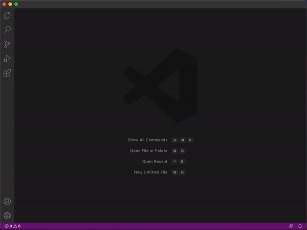

# "Hello world" VS code extension written in Kotlin/JS

This repository contains a project ready to build VS code extension written in Kotlin/JS. 
Don't ask my why, just for fun.

Currently, [dukat](https://kotlinlang.org/docs/js-external-declarations-with-dukat.html) generates 
slightly incorrect Kotlin mappings of 
[vscode type declarations](https://www.npmjs.com/package/@types/vscode) so the module 
[vscode](./vscode) contains fixed version of automatically generated mappings.

The extension register command `helloworld.helloWorld` with displayed name `Hello world` that shows
popup message "Hello World from Kotlin/JS!"

## How to install the extension?

Just execute the command `./gradlew installExtension` or `gradlew installExtension` depending on your OS.
